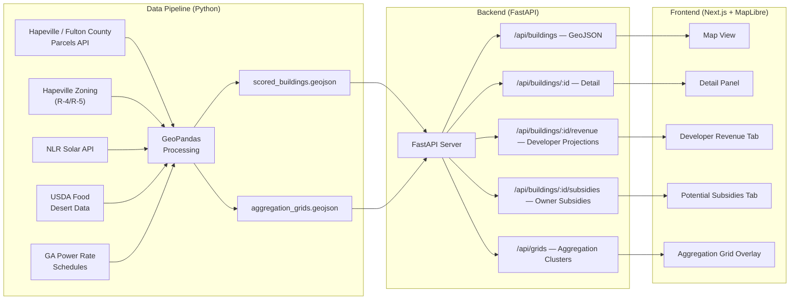

# Roofus v2 — Multifamily Rooftop Agriculture Platform

**Goal:** A dual-sided B2B platform connecting urban agricultural developers with multifamily building owners. Developers discover optimal rooftops; owners unlock passive lease revenue and utility subsidies.

**Scope:** Exclusively multifamily residential (townhomes, apartments) in **Hapeville, GA** — zoning codes R-4 and R-5.

**Target:** Weekend hackathon demo with ~500–1,000 scored multifamily buildings.

---

## User Review Required

> [!IMPORTANT]
> **API Key Needed:**
> - **NLR Solar API** — Free signup at [developer.nlr.gov/signup](https://developer.nlr.gov/signup/). You'll need an `NLR_API_KEY`.
> - **MapTiler** (for MapLibre dark tiles) — Free at [maptiler.com](https://www.maptiler.com/) (unlimited non-commercial use). Optional — can use free OSM tiles instead.
>
> No other API keys required. MapLibre is fully free/open-source.

## Open Questions

> [!IMPORTANT]
> 1. **HVAC detection method for MVP:** Satellite imagery analysis for rooftop HVAC units requires ML/computer vision. For the hackathon, should we use building age + size as a proxy (post-1990 + >10,000 sq ft = likely commercial HVAC), or do you have another approach in mind?
> 2. **Mock vs. real data:** Should I generate realistic mock data for the demo, or attempt to pull live from Hapeville / Fulton County GIS APIs?

---

## Architecture Overview



---

## Two Personas, Two Interfaces

| | **Urban Ag Developer** | **Multifamily Building Owner** |
|---|---|---|
| **Primary action** | Discover & filter optimal Hapeville rooftops | Understand revenue potential & subsidy eligibility |
| **Key metrics** | Viability score, roof area, food desert proximity | Lease income, subsidy value, aggregation bonus |
| **Tab in Detail Panel** | 🌱 Developer Revenue | 🏢 Potential Subsidies |
| **Map focus** | Color-coded viability scores | Aggregation grid blocks |

---

## Project Structure

```
roofus/
├── pipeline/                         # Python data pipeline
│   ├── requirements.txt
│   ├── config.py                     # Bounding boxes, zoning filters, weights
│   ├── download_data.py              # Fetch parcels, zoning, food desert data
│   ├── filter_multifamily.py         # Isolate R-4, R-5, MR, MRC parcels
│   ├── detect_hvac_proxy.py          # Structural load capacity proxy
│   ├── cluster_aggregation.py        # 0.5-mile radius aggregation grid blocks
│   ├── enrich_solar.py               # NLR Solar API integration
│   ├── enrich_food_desert.py         # USDA LILA overlay
│   ├── calculate_subsidies.py        # Georgia Power program eligibility
│   ├── score_buildings.py            # Viability scoring algorithm
│   ├── run_pipeline.py               # Orchestrator
│   └── data/
│       ├── raw/
│       └── processed/
│           ├── scored_buildings.geojson
│           └── aggregation_grids.geojson
│
├── backend/                          # FastAPI server
│   ├── requirements.txt
│   ├── main.py
│   ├── routers/
│   │   ├── buildings.py              # Building endpoints
│   │   ├── revenue.py                # Developer revenue projections
│   │   ├── subsidies.py              # Owner subsidy calculations
│   │   └── grids.py                  # Aggregation grid endpoints
│   ├── models.py                     # Pydantic schemas
│   └── services/
│       ├── geojson_service.py        # Load & query GeoJSON
│       ├── revenue_service.py        # Developer P&L engine
│       ├── subsidy_service.py        # Georgia Power program eligibility engine
│       └── aggregation_service.py    # Grid cluster calculations
│
├── frontend/                         # Next.js 14+ (App Router)
│   ├── package.json
│   ├── next.config.ts
│   ├── .env.local                    # NEXT_PUBLIC_MAPTILER_KEY (optional)
│   ├── app/
│   │   ├── layout.tsx
│   │   ├── page.tsx
│   │   └── globals.css
│   ├── components/
│   │   ├── MapView.tsx               # "use client" — MapLibre map
│   │   ├── BuildingLayer.tsx         # Scored building polygons
│   │   ├── AggregationGridLayer.tsx  # 0.5-mile cluster overlays
│   │   ├── DetailPanel.tsx           # Main sidebar container
│   │   ├── ScoreGauge.tsx            # Animated viability score dial
│   │   ├── DeveloperRevenueTab.tsx   # Developer P&L, crop mix, ROI
│   │   ├── SubsidiesTab.tsx          # Owner subsidies dashboard
│   │   ├── ThresholdMeter.tsx        # Energy tier vs threshold indicator
│   │   ├── DemandResponseCard.tsx    # CL-1 / DPEC-5 / VPP education
│   │   ├── AggregationBonusCard.tsx  # Neighborhood 100kW aggregation
│   │   ├── CropMixSliders.tsx        # Interlocked crop allocation
│   │   ├── ProjectionChart.tsx       # Reusable SVG charts
│   │   ├── Legend.tsx                # Score color legend
│   │   └── Header.tsx               # Branding + persona toggle
│   ├── lib/
│   │   ├── api.ts                    # Fetch helpers
│   │   ├── types.ts                  # TypeScript interfaces
│   │   ├── revenueModel.ts           # Client-side developer P&L calc
│   │   └── subsidyModel.ts           # Client-side subsidy calc
│   └── public/
│       └── roofus-logo.svg
│
└── README.md
```

---

## Proposed Changes

### Component 1: Data Pipeline

---

#### [NEW] [filter_multifamily.py](file:///home/kevon/.gemini/antigravity/scratch/roofus/pipeline/filter_multifamily.py)

Core filter that narrows the dataset to multifamily residential only:

```python
# Hapeville zoning codes that qualify
ELIGIBLE_ZONES = {
    'R-4',   # General Residential / Multifamily (up to 4 units)
    'R-5',   # Single-Family Attached and Detached
}

def filter_multifamily(buildings_gdf, zoning_gdf):
    """Spatial join Hapeville buildings with zoning, keep only R-4/R-5."""
    joined = gpd.sjoin(buildings_gdf, zoning_gdf, how='inner', predicate='within')
    return joined[joined['ZONINGCODE'].isin(ELIGIBLE_ZONES)]
```

#### [NEW] [detect_hvac_proxy.py](file:///home/kevon/.gemini/antigravity/scratch/roofus/pipeline/detect_hvac_proxy.py)

Uses building metadata as a **software proxy** for rooftop commercial HVAC (indicator of structural load capacity):

| Signal | Proxy Logic | Score Contribution |
|--------|------------|-------------------|
| Building year ≥ 1990 | Modern building codes require higher roof load ratings | +30 |
| Total units ≥ 8 | Larger multifamily = commercial-grade HVAC likely | +25 |
| Roof area ≥ 5,000 sq ft | Enough area for both HVAC and greenhouse | +20 |
| Building height ≤ 4 stories | Lower buildings = more accessible rooftop | +15 |
| Flat roof indicator | Parcel data or building type inference | +10 |

Combined into a **Structural Readiness Score (0–100)** that feeds into the overall viability score.

> [!NOTE]
> For the MVP, we use metadata heuristics. A future version could use satellite imagery + ML to detect actual HVAC equipment on rooftops.

#### [NEW] [cluster_aggregation.py](file:///home/kevon/.gemini/antigravity/scratch/roofus/pipeline/cluster_aggregation.py)

Groups eligible buildings into **Aggregation Grid Blocks** based on proximity:

```python
def build_aggregation_grids(buildings_gdf, radius_miles=0.5):
    """
    Cluster eligible buildings within 0.5-mile radius.
    Uses DBSCAN spatial clustering on building centroids.

    Returns: GeoDataFrame of grid polygons (convex hulls)
    with properties:
      - grid_id: unique cluster ID
      - building_count: number of buildings in cluster
      - total_units: sum of residential units
      - total_roof_sqft: combined roof area
      - estimated_combined_kw: sum of estimated peak demand
      - meets_vpp_threshold: bool (combined_kw >= 100)
      - meets_cl1_threshold: bool (combined_kw >= 200)
      - aggregation_tier: "VPP" | "CL-1" | "DPEC-5" | "Below Threshold"
    """
```

The 0.5-mile radius is converted to ~804 meters for the DBSCAN `eps` parameter. Clusters are represented as convex hull polygons on the map.

#### [NEW] [calculate_subsidies.py](file:///home/kevon/.gemini/antigravity/scratch/roofus/pipeline/calculate_subsidies.py)

Pre-calculates subsidy eligibility for each building based on Georgia Power programs:

| Program | Threshold | Per-Building Estimate | Source |
|---------|-----------|----------------------|--------|
| **VPP Pilot (Consumer-Directed)** | Any residential | $15/kW upfront + $1.50/kWh events | Georgia Power 2025 IRP |
| **VPP Pilot (Utility-Directed)** | Any residential | $750/kW (standard) or $1,000/kW (LMI/MUSH) | Georgia Power 2025 IRP |
| **CL-1 (Curtailable Load)** | ≥200 kW aggregated | Negotiated $/kW credit | GA PSC tariff filing |
| **DPEC-5 (Demand Plus Energy)** | ≥200 kW aggregated | Monthly demand + energy credits (Jun–Sep) | GA PSC tariff filing |
| **TempCheck DR** | Smart thermostat | $50 enrollment + $25/year | Georgia Power residential |
| **GA Power MF Efficiency** | Per-unit measures | Up to $500/unit (whole house) | Georgia Power MF program |
| **GEFA HER (State)** | 20–35%+ savings | $2,000–$16,000/unit (income-based) | energyrebates.georgia.gov |
| **GEFA HEAR (State)** | ≥50% HH <150% AMI | Up to $14,000/household | energyrebates.georgia.gov |

Each building gets a `subsidy_summary` object with:
- `eligible_programs`: list of programs with estimated values
- `total_annual_subsidy_value`: sum of recurring annual incentives
- `total_onetime_value`: sum of one-time incentives/rebates
- `aggregation_grid_id`: which cluster it belongs to
- `aggregation_tier`: current tier based on cluster combined kW

#### [NEW] [score_buildings.py](file:///home/kevon/.gemini/antigravity/scratch/roofus/pipeline/score_buildings.py)

Revised scoring algorithm for multifamily:

| Factor | Weight | Source |
|--------|--------|--------|
| Structural Readiness (HVAC proxy) | 30% | `detect_hvac_proxy.py` |
| Roof area | 20% | Building footprint geometry |
| Solar exposure (GHI) | 15% | NLR Solar Resource API |
| Zoning favorability | 15% | R-4 > R-5 (R-4 permits higher-density multifamily) |
| Food desert proximity | 15% | USDA LILA census tract overlay |
| Aggregation bonus | 5% | Part of a qualifying grid block |

#### Output: `scored_buildings.geojson`

```json
{
  "type": "FeatureCollection",
  "features": [{
    "type": "Feature",
    "geometry": { "type": "Polygon", "coordinates": [...] },
    "properties": {
      "id": "BLD-001",
      "address": "142 Dogwood Ave, Hapeville, GA 30354",
      "roof_area_sqft": 8200,
      "year_built": 2003,
      "num_units": 24,
      "num_floors": 3,
      "zoning": "R-4",
      "owner_name": "Dogwood Gardens LLC",
      "owner_address": "PO Box 1234, Atlanta GA 30301",
      "owner_phone": "(404) 555-0183",
      "owner_email": "mgmt@dogwoodgardens.com",
      "avg_ghi": 5.08,
      "in_food_desert": true,
      "hvac_proxy_score": 82,
      "estimated_peak_kw": 45,
      "aggregation_grid_id": "GRID-007",
      "score": 76.3,
      "score_structural": 82,
      "score_area": 70,
      "score_solar": 83,
      "score_zoning": 60,
      "score_food_desert": 100,
      "score_aggregation": 80,
      "subsidy_summary": {
        "eligible_programs": ["VPP-Consumer", "VPP-Utility", "TempCheck", "GEFA-HER", "GP-MF-Efficiency"],
        "total_annual_value": 4850,
        "total_onetime_value": 18500,
        "aggregation_tier": "VPP",
        "grid_combined_kw": 156,
        "grid_building_count": 5
      }
    }
  }]
}
```

#### Output: `aggregation_grids.geojson`

```json
{
  "type": "FeatureCollection",
  "features": [{
    "type": "Feature",
    "geometry": { "type": "Polygon", "coordinates": [...] },
    "properties": {
      "grid_id": "GRID-007",
      "building_count": 5,
      "total_units": 87,
      "total_roof_sqft": 34500,
      "combined_peak_kw": 156,
      "meets_vpp_threshold": true,
      "meets_cl1_threshold": false,
      "aggregation_tier": "VPP",
      "potential_annual_value": 23400,
      "buildings_needed_for_cl1": 2
    }
  }]
}
```

---

### Component 2: FastAPI Backend

Serves building data, revenue projections, subsidy calculations, and aggregation grids.

---

#### [NEW] [requirements.txt](file:///home/kevon/.gemini/antigravity/scratch/roofus/backend/requirements.txt)

```
fastapi>=0.111
uvicorn[standard]
pydantic>=2.0
python-dotenv
```

#### [NEW] [main.py](file:///home/kevon/.gemini/antigravity/scratch/roofus/backend/main.py)

- FastAPI app with CORS middleware
- Loads both GeoJSON files into memory on startup
- Includes routers: `buildings`, `revenue`, `subsidies`, `grids`
- Health check at `/health`

#### [NEW] [routers/buildings.py](file:///home/kevon/.gemini/antigravity/scratch/roofus/backend/routers/buildings.py)

| Endpoint | Method | Description |
|----------|--------|-------------|
| `/buildings` | GET | GeoJSON FeatureCollection (filterable) |
| `/buildings?min_score=60` | GET | Filter by minimum viability score |
| `/buildings?zoning=R-4` | GET | Filter by zoning classification (R-4 or R-5) |
| `/buildings?grid_id=GRID-007` | GET | Filter by aggregation grid |
| `/buildings/{id}` | GET | Single building with full detail |
| `/buildings/stats` | GET | Aggregate stats |

#### [NEW] [routers/subsidies.py](file:///home/kevon/.gemini/antigravity/scratch/roofus/backend/routers/subsidies.py)

| Endpoint | Method | Description |
|----------|--------|-------------|
| `/buildings/{id}/subsidies` | GET | Full subsidy eligibility breakdown |
| `/buildings/{id}/subsidies` | POST | Custom calculation with adjusted assumptions |
| `/grids/{grid_id}/subsidies` | GET | Aggregation-level subsidy totals |

GET response for `/buildings/{id}/subsidies`:
```json
{
  "building_id": "BLD-001",
  "energy_profile": {
    "estimated_peak_kw": 45,
    "estimated_annual_kwh": 197000,
    "current_rate_schedule": "R-30",
    "summer_rate_tier": "$0.146/kWh (650-1000 kWh band)",
    "annual_energy_cost_estimate": 18400
  },
  "threshold_indicator": {
    "current_tier": "Mid",
    "target_tier": "Baseline",
    "kwh_reduction_needed": 2400,
    "pct_reduction_needed": 12,
    "greenhouse_demand_shed_potential_kw": 8
  },
  "demand_response_programs": {
    "vpp_consumer": {
      "eligible": true,
      "upfront_incentive_per_kw": 15,
      "performance_incentive_per_kwh": 1.50,
      "estimated_annual_value": 1200,
      "description": "Georgia Power VPP Pilot — Consumer-Directed. Greenhouse lighting/pump loads can be shed during summer peaks."
    },
    "vpp_utility": {
      "eligible": true,
      "upfront_incentive_per_kw": 750,
      "lmi_incentive_per_kw": 1000,
      "estimated_onetime_value": 6000,
      "description": "Georgia Power VPP Pilot — Utility-Directed. Higher upfront incentive for LMI-qualifying properties."
    },
    "tempcheck": {
      "eligible": true,
      "enrollment_bonus": 50,
      "annual_incentive": 25,
      "per_unit_value": 75,
      "total_property_value": 1800,
      "description": "TempCheck thermostat DR. $50 enrollment + $25/year per unit with smart thermostat."
    },
    "cl1_aggregated": {
      "eligible": false,
      "reason": "Grid GRID-007 at 156 kW — needs 200 kW for CL-1 eligibility",
      "kw_shortfall": 44,
      "buildings_needed": 2,
      "potential_value_if_eligible": "Negotiated — typically $3-8/kW/month"
    },
    "dpec5_aggregated": {
      "eligible": false,
      "reason": "Same 200 kW threshold as CL-1",
      "summer_credit_months": "June-September",
      "potential_value_if_eligible": "Monthly demand + energy credits during peak events"
    }
  },
  "efficiency_rebates": {
    "gp_multifamily": {
      "eligible": true,
      "max_per_unit": 500,
      "total_property_max": 12000,
      "measures": ["Attic insulation ($125)", "Air sealing ($150)", "Duct sealing ($150)", "AC upgrade ($25)"]
    },
    "gefa_her": {
      "eligible": true,
      "savings_tier": "20-34%",
      "per_unit_rebate": 2000,
      "lmi_per_unit_rebate": 10000,
      "total_property_estimate": 48000,
      "description": "Georgia Energy Finance Authority Home Efficiency Rebates"
    },
    "gefa_hear": {
      "eligible": "income_dependent",
      "max_per_household": 14000,
      "description": "Heat pump, panel, wiring, water heater rebates for LMI properties"
    }
  },
  "aggregation_bonus": {
    "grid_id": "GRID-007",
    "grid_combined_kw": 156,
    "current_tier": "VPP",
    "next_tier": "CL-1 / DPEC-5",
    "kw_to_next_tier": 44,
    "buildings_to_next_tier": 2,
    "current_grid_annual_value": 23400,
    "next_tier_annual_value": 38500,
    "uplift_if_threshold_met": 15100
  }
}
```

#### [NEW] [routers/grids.py](file:///home/kevon/.gemini/antigravity/scratch/roofus/backend/routers/grids.py)

| Endpoint | Method | Description |
|----------|--------|-------------|
| `/grids` | GET | All aggregation grid polygons (GeoJSON) |
| `/grids/{grid_id}` | GET | Single grid detail with member buildings |
| `/grids/{grid_id}/buildings` | GET | Buildings in this grid |

#### [NEW] [routers/revenue.py](file:///home/kevon/.gemini/antigravity/scratch/roofus/backend/routers/revenue.py)

Same developer revenue endpoints as before — `/buildings/{id}/revenue` GET and POST with crop mix, operating costs (itemized Atlanta utility rates), ROI projections.

---

### Component 3: Next.js Frontend (MapLibre)

---

#### Key Dependency Changes (MapLibre vs Mapbox)

```
- react-map-gl@8.1.1 (import from 'react-map-gl/maplibre')
- maplibre-gl@4.x (instead of mapbox-gl)
- No access token required
```

Base map style: `https://api.maptiler.com/maps/dataviz-dark/style.json?key={KEY}` or free alternative `https://basemaps.cartocdn.com/gl/dark-matter-gl-style/style.json`

#### [NEW] [components/Header.tsx](file:///home/kevon/.gemini/antigravity/scratch/roofus/frontend/components/Header.tsx)

- Roofus logo + wordmark
- **Persona toggle:** Two-state switch — "I'm a Developer" ↔ "I'm a Building Owner"
  - Switches the default tab in the Detail Panel
  - Changes map overlay (viability scores vs aggregation grids)
  - Persisted in localStorage
- Stats bar: "X multifamily buildings · Y aggregation grids · Z high-potential"

#### [NEW] [components/MapView.tsx](file:///home/kevon/.gemini/antigravity/scratch/roofus/frontend/components/MapView.tsx)

- MapLibre GL JS with dark base style (CARTO Dark Matter or MapTiler DataViz Dark)
- Initial view: centered on Hapeville (~33.6693, -84.4102), zoom 14
- Two layer modes toggled by persona:
  - **Developer mode:** Buildings colored by viability score (choropleth)
  - **Owner mode:** Buildings colored by subsidy tier + aggregation grid overlays

#### [NEW] [components/AggregationGridLayer.tsx](file:///home/kevon/.gemini/antigravity/scratch/roofus/frontend/components/AggregationGridLayer.tsx)

- Renders aggregation grid polygons (convex hulls) as semi-transparent overlays
- Color-coded by tier:
  - `CL-1 / DPEC-5 eligible` (≥200 kW): `--accent-emerald` at 15% opacity
  - `VPP eligible` (100–199 kW): `--accent-cyan` at 15% opacity
  - `Below threshold` (<100 kW): `--score-moderate` at 10% opacity
- Dashed border outline
- On hover: tooltip showing grid stats (building count, combined kW, tier)
- On click: highlights all member buildings, shows grid detail

#### [NEW] [components/DetailPanel.tsx](file:///home/kevon/.gemini/antigravity/scratch/roofus/frontend/components/DetailPanel.tsx)

Top section (always visible):
- Score gauge, score breakdown (6 factors), property details, owner contact info

Bottom section (tabbed):
- **Tab 1: 🌱 Developer Revenue** — P&L, crop mix, ROI (same as before)
- **Tab 2: 🏢 Potential Subsidies** — the new owner-focused dashboard

#### [NEW] [components/SubsidiesTab.tsx](file:///home/kevon/.gemini/antigravity/scratch/roofus/frontend/components/SubsidiesTab.tsx)

The core new feature. Three stacked sections:

**Section 1: Threshold Indicator (`ThresholdMeter.tsx`)**
```
┌─────────────────────────────────────┐
│  ENERGY THRESHOLD STATUS            │
│                                     │
│  Current Annual Usage    197,000 kWh│
│  Target Baseline         175,000 kWh│
│  Reduction Needed          12%      │
│                                     │
│  ┌─────────────────────────────┐    │
│  │ ▓▓▓▓▓▓▓▓▓▓▓▓▓▓▓▓▓░░░░│←target│
│  │ CURRENT ━━━━━━━━━━━━━━━━━━┤    │
│  └─────────────────────────────┘    │
│                                     │
│  🌿 Greenhouse load-shedding can   │
│  reduce peak demand by ~8 kW,      │
│  helping maintain baseline tier.    │
└─────────────────────────────────────┘
```
- Static meter showing current energy usage vs. target threshold
- Color: amber if above target, emerald if at/below
- Explainer text about how greenhouse demand shedding helps

**Section 2: Demand Response Programs (`DemandResponseCard.tsx`)**
```
┌─────────────────────────────────────┐
│  DEMAND RESPONSE PROGRAMS           │
│                                     │
│  ┌───────────────────────────────┐  │
│  │ ✅ VPP Pilot (Consumer)      │  │
│  │ $15/kW upfront + $1.50/kWh   │  │
│  │ Est. value: $1,200/year      │  │
│  │                               │  │
│  │ Greenhouse lighting & pump    │  │
│  │ loads can be shed during      │  │
│  │ summer peaks (Jun-Sep),       │  │
│  │ keeping the facility below    │  │
│  │ critical utility brackets.    │  │
│  └───────────────────────────────┘  │
│                                     │
│  ┌───────────────────────────────┐  │
│  │ ✅ VPP Pilot (Utility-Dir.)  │  │
│  │ $750/kW upfront ($1,000 LMI) │  │
│  │ Est. one-time: $6,000        │  │
│  └───────────────────────────────┘  │
│                                     │
│  ┌───────────────────────────────┐  │
│  │ ✅ TempCheck DR               │  │
│  │ $50 + $25/yr × 24 units      │  │
│  │ Est. value: $1,800 first yr  │  │
│  └───────────────────────────────┘  │
│                                     │
│  ┌───────────────────────────────┐  │
│  │ ⚠️ CL-1 Curtailable Load     │  │
│  │ Requires 200 kW (grid at     │  │
│  │ 156 kW — 44 kW short)        │  │
│  │ See Aggregation Bonus ↓      │  │
│  └───────────────────────────────┘  │
│                                     │
│  ┌───────────────────────────────┐  │
│  │ 💰 GEFA Efficiency Rebates   │  │
│  │ Up to $10,000/unit (LMI)     │  │
│  │ Est. property total: $48,000 │  │
│  └───────────────────────────────┘  │
│                                     │
│  Total Potential Value              │
│  $58,000+ one-time                  │
│  $4,850/year recurring              │
└─────────────────────────────────────┘
```
- Each program is a card: ✅ = eligible, ⚠️ = conditionally eligible, ❌ = not eligible
- Eligible cards have emerald left border, conditional have amber, ineligible have red
- Each card shows: program name, incentive structure, estimated value, plain-English explanation of how greenhouse leasing enables eligibility
- Bottom summary: total one-time and recurring values

**Section 3: Aggregation Bonus (`AggregationBonusCard.tsx`)**
```
┌─────────────────────────────────────┐
│  NEIGHBORHOOD AGGREGATION BONUS     │
│                                     │
│  Grid: GRID-007 (5 buildings)       │
│  Combined Load: 156 kW              │
│                                     │
│  ┌─────────────────────────────┐    │
│  │ VPP (100kW) ✅  CL-1 (200kW)│    │
│  │ [████████████████░░░░░░░░░] │    │
│  │  156 kW ──────→ 200 kW     │    │
│  └─────────────────────────────┘    │
│                                     │
│  Current tier: VPP                  │
│  Grid annual value: $23,400         │
│                                     │
│  ─────────────────────────────────  │
│                                     │
│  🔓 UNLOCK CL-1 / DPEC-5           │
│  Need 44 kW more (≈2 buildings)    │
│  Unlocks: $38,500/yr (+$15,100)    │
│                                     │
│  Adjacent eligible buildings:       │
│  • 188 Dogwood Ave (est. 28 kW)    │
│  • 201 Birch St (est. 22 kW)      │
│  [View on map →]                    │
│                                     │
└─────────────────────────────────────┘
```
- Progress bar showing current combined kW vs. threshold tiers
- Tier milestones marked on the bar (100 kW = VPP, 200 kW = CL-1/DPEC-5)
- "Unlock" section shows what it takes to reach the next tier
- Lists nearby eligible buildings that could join the cluster
- "View on map" highlights those buildings on the map

---

## Build Order (Weekend Sprint)

### Phase 1: Data Pipeline (Saturday Morning, ~3 hours)
1. Set up `pipeline/` with dependencies
2. Implement `download_data.py` — fetch Hapeville / Fulton County parcels + zoning layers
3. Implement `filter_multifamily.py` — isolate R-4, R-5 buildings in Hapeville
4. Implement `detect_hvac_proxy.py` — structural readiness scoring
5. Implement `cluster_aggregation.py` — DBSCAN 0.5-mile clustering
6. Implement `score_buildings.py` — viability scoring
7. Output both GeoJSON files

### Phase 2: Subsidy Engine (Saturday Afternoon, ~2 hours)
1. Implement `calculate_subsidies.py` — Georgia Power program eligibility logic
2. Build `subsidy_service.py` in backend
3. Build `aggregation_service.py` in backend
4. Wire up `/subsidies` and `/grids` API endpoints

### Phase 3: Backend API (Saturday Late Afternoon, ~1.5 hours)
1. Set up FastAPI project
2. Implement `/buildings` endpoints
3. Implement `/buildings/{id}/revenue` endpoints
4. Test with `curl` / Swagger UI

### Phase 4: Frontend — Map (Saturday Evening, ~3 hours)
1. Scaffold Next.js project with MapLibre
2. Set up design system (`globals.css`) — dark mode, glassmorphism
3. Build `MapView` + `BuildingLayer` + `AggregationGridLayer`
4. Build `Header` with persona toggle
5. Build `Legend`
6. Verify end-to-end: pipeline → API → map

### Phase 5: Frontend — Detail Panel (Sunday Morning, ~4 hours)
1. Build `DetailPanel` with score breakdown + owner contact info
2. Build `ScoreGauge` animation
3. Build `DeveloperRevenueTab` (P&L, crop mix, charts)
4. Build `SubsidiesTab` with three sections:
   - `ThresholdMeter` — energy tier indicator
   - `DemandResponseCard` — program cards with eligibility
   - `AggregationBonusCard` — grid progress bar + unlock section
5. Wire up persona toggle → tab defaults

### Phase 6: Polish & Demo (Sunday Afternoon, ~2 hours)
1. Enrich with real solar data (NLR API)
2. Add hover effects, transitions, micro-animations
3. Mobile responsiveness (bottom sheet)
4. Generate Roofus logo/branding
5. Record demo / prep pitch

---

## Verification Plan

### Automated Tests
```bash
# Pipeline: verify filtered output
cd pipeline && python -c "
import json
data = json.load(open('data/processed/scored_buildings.geojson'))
grids = json.load(open('data/processed/aggregation_grids.geojson'))
print(f'{len(data[\"features\"])} multifamily buildings scored')
print(f'{len(grids[\"features\"])} aggregation grids created')
zones = set(f['properties']['zoning'] for f in data['features'])
print(f'Zoning codes present: {zones}')
"

# Backend: verify API
cd backend && uvicorn main:app --reload &
curl http://localhost:8000/health
curl http://localhost:8000/buildings/stats
curl http://localhost:8000/buildings/BLD-001/subsidies | python -m json.tool | head -40
curl http://localhost:8000/grids | python -m json.tool | head -20

# Frontend: dev server
cd frontend && npm run dev
```

### Manual Verification
- [ ] Map loads centered on Hapeville with dark base style
- [ ] Only multifamily buildings visible (R-4, R-5 zoning)
- [ ] Buildings color-coded by viability score
- [ ] Aggregation grid overlays visible in Owner mode
- [ ] Persona toggle switches map layers and default tabs
- [ ] Clicking building opens detail panel with score breakdown
- [ ] Developer Revenue tab shows P&L with crop mix sliders
- [ ] Subsidies tab: Threshold Meter shows current vs target
- [ ] Subsidies tab: Program cards show ✅/⚠️/❌ with correct values
- [ ] Subsidies tab: Aggregation Bonus shows grid progress + unlock path
- [ ] Owner contact info displays with clickable email/phone
- [ ] Mobile layout works (bottom sheet)
